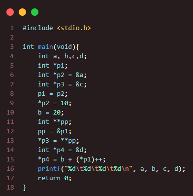
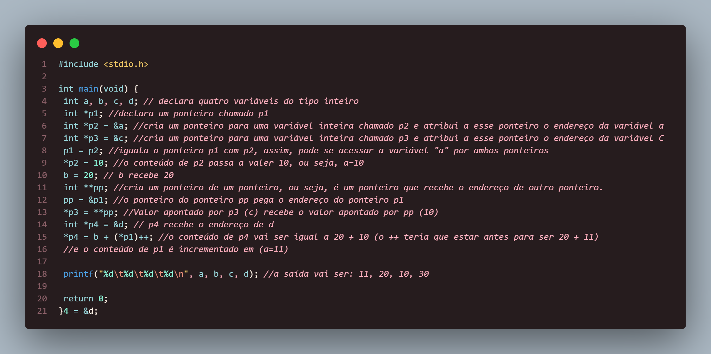

### Questão 3
---
Qual será a saída exibida pelo programa a seguir:

Observe que, se int *p é uma variável do tipo ponteiro para inteiro, então int **pp é uma
variável do tipo ponteiro para ponteiro de inteiro, isto é, uma varável que poderá armazenar o
endereço de um ponteiro do tipo int. 
###### *Resposta:* 

a saída vai ser: 11 20 10 30

