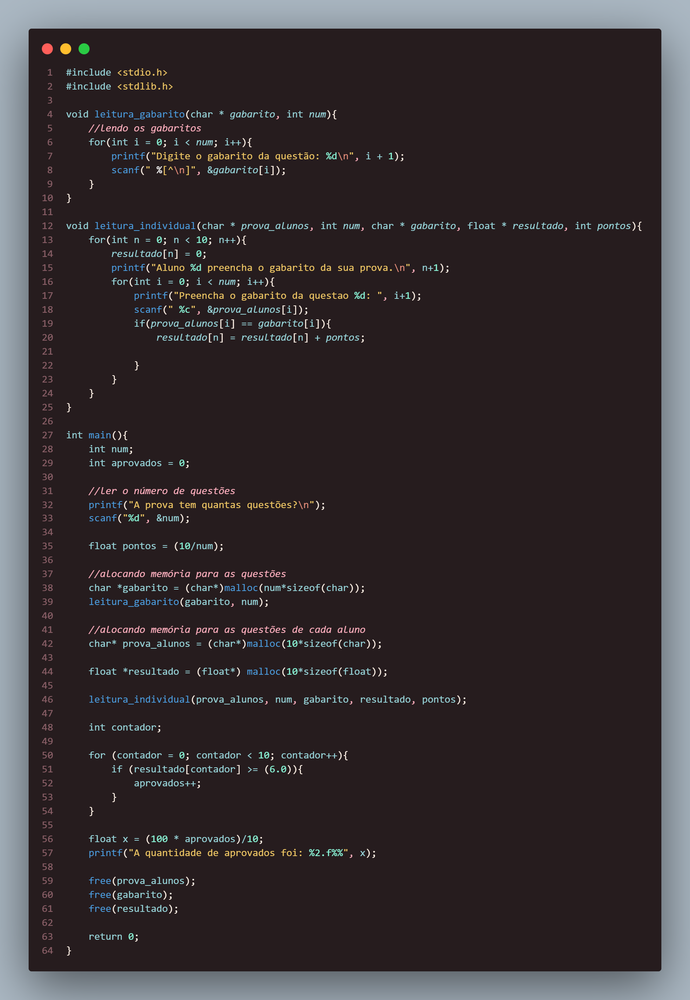

### Questão 1
---
Escreva um programa para corrigir provas de múltipla escolha. Cada prova tem N
questões e cada questão vale 10/N pontos. Os primeiros dados a serem lidos são o número de
questões e o gabarito da prova. Em seguida, serão lidas as respectivas respostas de um total de
10 alunos matriculados. Calcule e mostre:  
a) a nota obtida para cada aluno;  
b) a porcentagem de aprovação, sabendo-se que a nota mínima para ser aprovado é 6.  

###### *Resposta:* 
O código está em outro arquivo nessa pasta, mas aqui está a foto da resolução:

