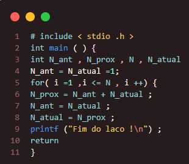

### Questão 3
---
Identifique os erros de compilacão que seriam detectados no seguinte programa se eles existirem:

###### *Resposta:* Identifiquei os seguintes erros:
 ###### - ao declarar as variáveis, faltou um ponto e vírgula (terceira linha);
 ###### - está faltando uma chave para fechar a função;
 ###### - a variável i do for não foi declarada inicialmente;
 ###### - faltou ponto e vígula no return (era para ser return 0;);